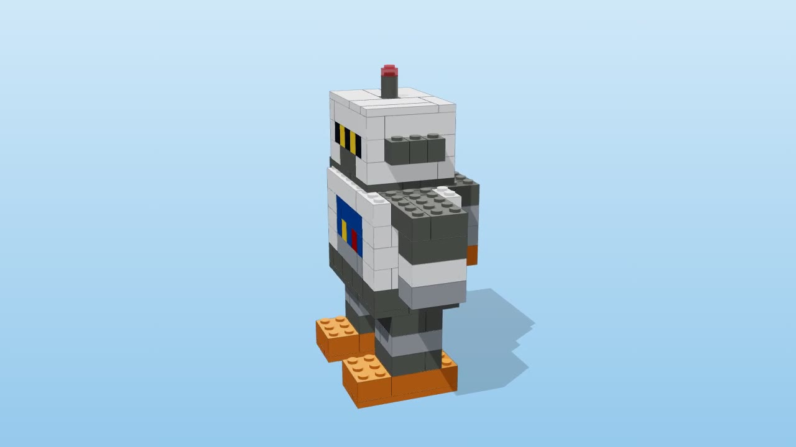
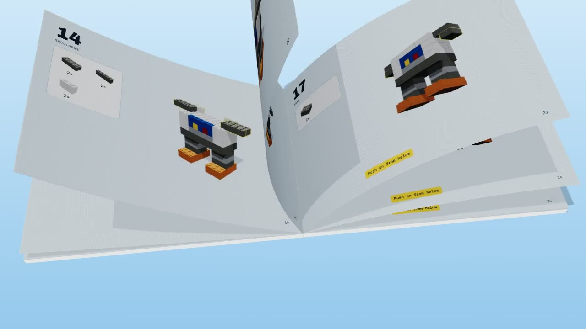
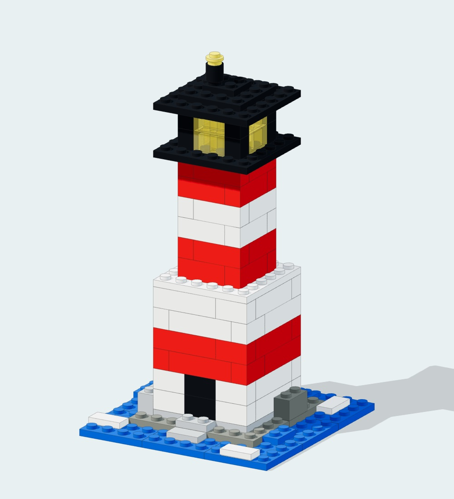
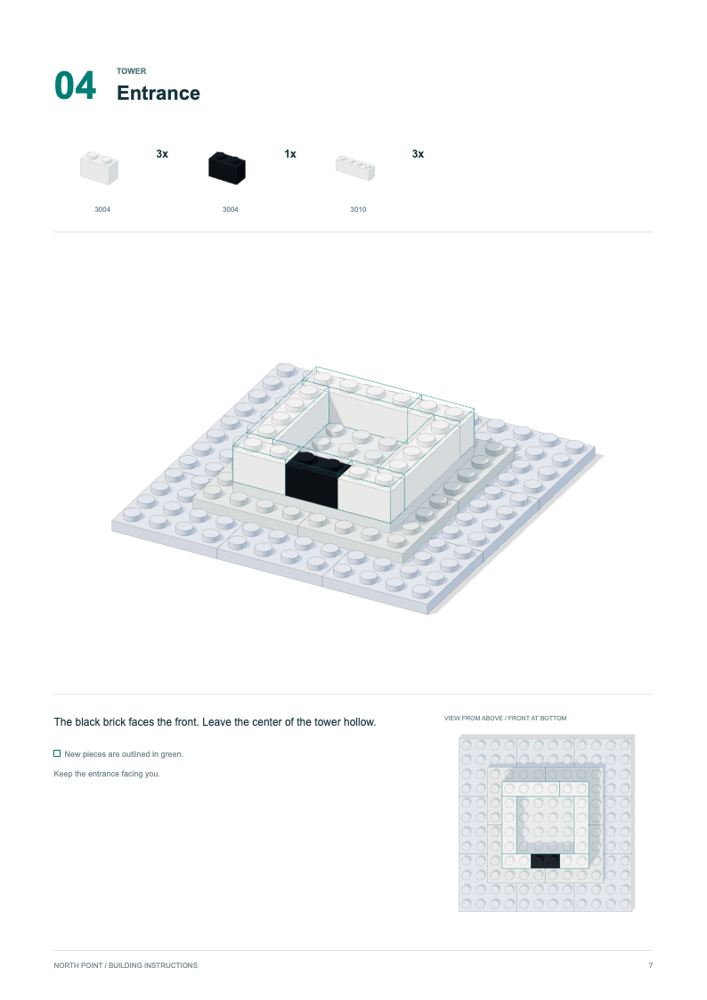

# AI LEGO

AI-designed LEGO models, assembly animations, and instruction books.

[Bolt the Brick Bot](#bolt-the-brick-bot) | [North Point Lighthouse](#north-point-lighthouse)

## Bolt the Brick Bot

A 138-piece robot built from standard LEGO bricks, plates and tiles. It was designed and checked in code, then turned into a printable instruction booklet and a build animation with ASMR sound.



- **Watch:** [`bolt-showreel.mp4`](bolt-showreel.mp4). 36 seconds with sound: a flip-through of the booklet, then every piece sliding and clicking into place.
- **Build it:** [`bolt-instructions.pdf`](bolt-instructions.pdf). 37 pages: cover, parts list and 31 steps.
- **Spin it:** [interactive 3D viewer](https://claude.ai/artifact/7Brrus3CuZGsxKiD9zyQbr), with step-by-step and exploded views.
- **Order the parts:** open [`robot.ldr`](robot.ldr) in BrickLink Studio or LeoCAD.



### What the checker verifies

`design.py` places every part on a stud grid, then replays the build in booklet order and checks each step:

| Check | Result |
|---|---|
| Pieces | 138 in 41 part/colour lots |
| Size | 12.0 × 6.4 × 14.4 cm |
| Collisions | 0 |
| Stud connections | 559 |
| One connected structure | Yes |
| Every step buildable | Yes. Each part clips onto parts already built, from a direction that is still open |
| Stands at every step | Yes. The final centre of mass is 2.3 studs inside the feet |
| Single-stud joints | 1 (the antenna tip) |

The arms and backpack hang under the shoulders, so the booklet has you push them on from below after the shoulder layer is built.

### How it works

| File | Role |
|---|---|
| `design.py` | The robot as layers of coloured cells. A backtracking tiler covers each layer with real parts so every part rests on studs. Runs the checks, then writes `robot.ldr` and `model.js`. |
| `lego3d.js` | three.js part meshes, camera framing, and the showreel timeline. |
| `book3d.js` | The booklet as a 3D book with curling pages for the intro. |
| `asmr.js` | Procedural Web Audio sound: slides, stud clicks (pitched by part size, panned by position), page flips and whooshes. |
| `viewer.html` | Interactive viewer. |
| `booklet.html` | The instruction booklet layout, rendered live in the browser. |
| `record.html`, `export.mjs` | Headless Chrome export of the PDF, page images and MP4 (ffmpeg). |

### Rebuild

Needs Python 3, Node 18+, Google Chrome and ffmpeg.

```sh
npm install
npm run design   # redesign + checks -> robot.ldr, model.js
npm run pdf      # bolt-instructions.pdf + pages/*.jpg
npm run video    # bolt-showreel.mp4 (about 15 min on an older laptop)
npm run serve    # then open http://localhost:8000/viewer.html
```

To change the robot, edit the `layer(...)` calls in `design.py` and rerun it. The checker reports any collision, floating part or unbuildable step.

### How it was made

The Bolt example was made in one Claude Code session on 24 September 2026. The session started from four screenshots of a post about Opus 5.5 designing a LEGO model and the request "I want to see this happen." It covered the design, the checks, the booklet, the animation, the sound, the book flip-through and this repo. The figures are from `/cost` at the end of the session:

| | |
|---|---|
| Model | Claude Opus 5.5 (plus a tiny amount of Claude Haiku 4.5) |
| Total cost | $7.43 |
| Model time (API) | 21 min 20 s |
| Wall-clock time | 4 h 34 min, including idle time and the headless video renders on an older Intel Mac |
| Code written | 1,533 lines added, 20 removed |
| Output tokens | 121.0k |
| Input tokens | 2.6k uncached + 339.0k cache writes + 11.4M cache reads |

Nearly all the input was cache reads: each request re-reads the conversation so far, and 97% of that came from the prompt cache.

---

## North Point Lighthouse

A 111-piece red-and-white lighthouse, created from scratch with OpenAI Codex on 24 September 2026. It uses ordinary bricks and plates, transparent yellow lantern windows, and official LDraw part geometry. The same digital model supplies the assembly animation and illustrated instruction book.



- **Watch:** [`north-point-assembly.mp4`](north-point/north-point-assembly.mp4). 26 seconds, 1280 x 720 at 24 fps: an assembled view, piece-by-piece construction, an exploded view, and reassembly. No audio.
- **Build it:** [`north-point-instructions.pdf`](north-point/north-point-instructions.pdf). 28 pages: cover, two inventory pages, 24 build steps, and closing notes. Every step includes a perspective diagram and an overhead placement view.
- **Inspect the model:** [`lighthouse.mpd`](north-point/lighthouse.mpd) includes the part geometry; [`lighthouse.ldr`](north-point/lighthouse.ldr) is the standard model with step markers.
- **Find the parts:** [`parts.csv`](north-point/parts.csv) and [`bricklink-wanted.xml`](north-point/bricklink-wanted.xml). The wanted list is for review and import; current seller availability was not exhaustively checked.



### What the checker verifies

The design places each part on a stud-and-plate grid and checks the assembly order. A separate browser check measures the loaded official geometry against the design dimensions.

| Check | Result |
|---|---|
| Pieces | 111 in 24 part/color lots, using 11 part shapes |
| Size | 9.6 x 9.6 x 17.44 cm, including the top stud |
| Brick-body overlaps | 0 within the nominal rectangular body envelopes |
| Mating stud positions | 406 across 180 connected part pairs |
| Unsupported added pieces | 0 above the table |
| Blocked vertical insertion paths | 0 in the specified assembly order |
| One connected structure | Yes, from step 2 onward |
| Geometry checks | All 111 parts have the expected identity and measured dimensions |
| Browser checks | Passed at 1440 x 1000, 390 x 844, and 320 x 700 |
| Viewer controls | Playback, exploded view, step navigation, and inventory search passed |

The nine blue plates start separately on the table in step 1. The gray island plates bridge their seams and join the base in step 2. New pieces are outlined in green in the book; earlier pieces are muted for clarity.

These are digital checks, not a physical trial build. They do not establish clutch strength, material stress, real manufacturing tolerances, or measured stability. Intended stud/socket engagement is excluded from the brick-body overlap check.

### How it works

The design generator writes the placements, assembly steps, inventory, and checks. Three.js loads the official LDraw geometry for rendering. Headless Chrome produces the diagrams and PDF, and ffmpeg encodes 624 rendered frames into the MP4. An interactive local viewer also provides orbit controls, playback, exploded views, build steps, and searchable parts.

| File | Role |
|---|---|
| [`lighthouse.ldr`](north-point/lighthouse.ldr) | All 111 part placements, colors, and assembly-step markers. |
| [`lighthouse.mpd`](north-point/lighthouse.mpd) | The model plus 47 embedded official LDraw part, subpart, and primitive files. |
| [`parts.csv`](north-point/parts.csv) | Quantities for the 24 part/color combinations. |
| [`bricklink-wanted.xml`](north-point/bricklink-wanted.xml) | Parts list in BrickLink import format. |
| [`checks.json`](north-point/checks.json) | Placement, support, insertion-path, and connectivity results, with the scope of the checks. |
| [`geometry-checks.json`](north-point/geometry-checks.json) | Expected and rendered dimensions for each part. |
| [`browser-checks.json`](north-point/browser-checks.json) | Desktop/mobile rendering and interaction checks, with no browser errors recorded. |

### How it was made

The same four screenshots prompted this experiment. After the request to start from scratch, Codex designed the lighthouse, downloaded official part definitions, implemented the renderer and export pipeline, generated the book and film, and checked the viewer on desktop and mobile. No Bolt code or assets were reused for the lighthouse.

These figures come from the local Codex session's cumulative usage records, measured from the "start from scratch" request through delivery. They exclude the earlier discussion, the later cost lookup, and preparation of these repository notes.

| | |
|---|---|
| Model | GPT-6 Astra, xhigh reasoning, via OpenAI Codex |
| Account usage | Logged under the ChatGPT Plus allowance; no per-build dollar invoice available |
| Estimated API token cost | $6.02 at Standard rates, for comparison only; not an actual charge |
| Wall-clock time | 1 h 57 min 54 s, including approval waits, rendering, and verification |
| Model time (API) | Not recorded separately |
| Output tokens | 38,127, including 11,630 reasoning tokens |
| Input tokens | 109,346 uncached + 3,017,728 cached; 0 cache-write tokens recorded |
| Total tokens | 3,165,201 |

About 96.5% of input tokens were cached rereads of conversation context. The API comparison uses the [published GPT-6 Astra Standard token rates](https://developers.openai.com/api/docs/pricing): $10 per million uncached input tokens, $1 per million cached input tokens, and $50 per million output tokens. The calculation is $1.09346 + $3.017728 + $1.90635 = $6.017538. It excludes any separate tool fees. [Codex subscription usage](https://learn.chatgpt.com/docs/pricing) is accounted for differently, so this estimate is not directly comparable to Bolt's reported session charge.

Part geometry comes from the [LDraw Official Parts Library](https://library.ldraw.org/), licensed under [CC BY 4.0](https://creativecommons.org/licenses/by/4.0/). Original author and license headers are retained in the packed MPD. Geometry was rendered with [Three.js LDrawLoader](https://threejs.org/docs/pages/LDrawLoader.html).

---

Bolt was designed with Claude Opus 5.5; North Point was designed with OpenAI Codex using GPT-6 Astra. LEGO® is a trademark of the LEGO Group, which does not sponsor or endorse this project.
